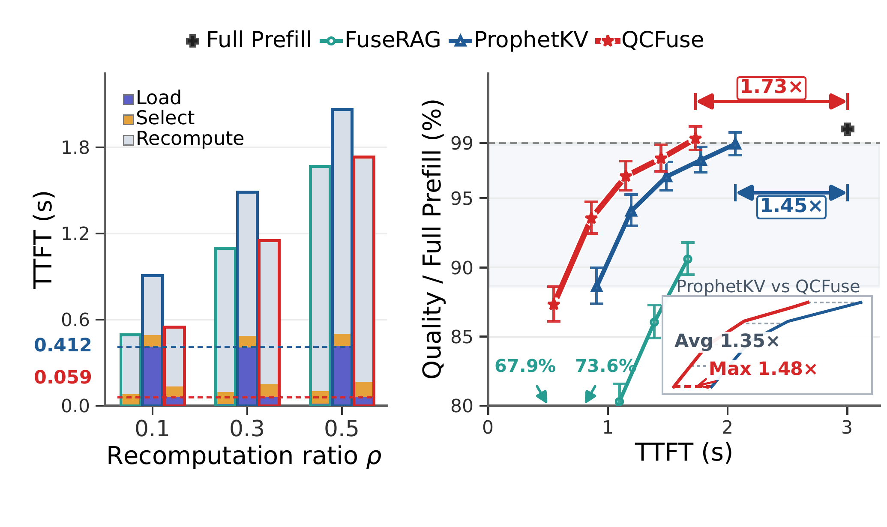

<table align="center">
  <tr>
    <td align="center" valign="middle" width="84">
      
    </td>
    <td valign="middle">
      <h1>
        <strong>QCFuse</strong>: Query-Aware Cache Fusion via Compressed View for Efficient RAG Serving
      </h1>
    </td>
  </tr>
</table>

<p align="center">
  <a href="https://arxiv.org/abs/2606.05875"></a>
  <a href="https://github.com/sgl-project/sglang/releases/tag/v0.5.4"></a>
  <a href="LICENSE"></a>
</p>

QCFuse is a **compressed-view, query-aware KV cache fusion** system for
efficient long-context RAG generation. It uses compact cached chunk anchors to
condition the query, scores every original context position at profiled layers,
and preserves the layer-wise cache-fusion pipeline. This repository contains
the research artifact described in the QCFuse paper.

## 🔥 News

- **2026.09.02** 🚀 We expanded every workload to 500 examples in the [QCFuse dataset](https://huggingface.co/datasets/Yjx666/qcfuse-dataset) and added [BIRD](https://bird-bench.github.io/), a new text-to-SQL evaluation workload.
- **2026.06.26** 🚀 QCFuse supports Qwen3-32B and evaluates Qwen3-8B/14B/32B reconstruction on LongBench under 5K context; see [results](md/qwen3_all_models_dataset_ttft_f1.png).
- **2026.06.02** 🚀 QCFuse released its SGLang integration and Triton-accelerated sparse reconstruction attention.

## ✨ Highlights

<p align="center">
  
</p>

<p align="center">
  <em>QCFuse builds a compact query-aware view for pipelined cache fusion in RAG serving.</em>
</p>

- **Compressed-view query-aware selection.** Reuses compact cached anchors from
  each retrieved chunk to condition queries, then scores all context positions
  using only profiled critical layers.
- **Pipeline-aware SGLang system.** Adds SSD-backed PIC cache transfer and
  Triton sparse reconstruction attention without materializing extra attention
  masks.
- **Smaller pre-fusion state view.** Reduces the context-dependent selector cost
  and KV state required before layer-wise fusion can begin.
- **Near-reference quality at lower TTFT.** Across five open-weight LLMs and
  seven workloads, reaches a **1.73x** TTFT speedup over Full Prefill
  (`fullcomp`) with less than a **1% drop in aggregate quality**, and up to
  **1.48x** over ProphetKV at matched aggregate quality.

## 📊 Results

<p align="center">
  
</p>

<p align="center">
  <em>Synchronized TTFT breakdown and aggregate quality trade-off. At its highest-quality point, QCFuse is 1.73x faster than Full Prefill (fullcomp) while keeping the aggregate-quality drop below 1%; at matched aggregate quality, it reaches up to 1.48x speedup over ProphetKV.</em>
</p>

## 🗂️ Repository Layout

```text
QCFuse/
├── blend/                         # QCFuse evaluation runner and configs
│   ├── sglang_blend_ssd.py
│   ├── blend_common.py
│   ├── qcfuse_config.py
│   ├── structured_eval.py
│   └── utils.py
├── srt/                           # SGLang runtime changes for QCFuse
│   ├── entrypoints/
│   ├── managers/
│   ├── layers/attention/
│   ├── models/
│   └── utils/
├── data/                          # Dataset instructions and local download target
│   └── README.md
```

## 🗄️ Datasets

The revised evaluation covers **seven workloads** across multi-hop QA,
long-context retrieval and tracking, and text-to-SQL. Each workload contains
500 paired examples, and retrieved contexts average about 10K tokens.

The prepared QCFuse data is hosted at
[Yjx666/qcfuse-dataset](https://huggingface.co/datasets/Yjx666/qcfuse-dataset).
Download the seven JSONL files into `data/` with:

```bash
pip install -U huggingface_hub
hf download Yjx666/qcfuse-dataset \
  --repo-type dataset \
  --include "*.jsonl" \
  --local-dir data
```

The resulting directory should contain:

```text
data/
├── musique.jsonl
├── 2wikimqa.jsonl
├── hotpotqa.jsonl
├── ruler_mq.jsonl
├── ruler_mv.jsonl
├── ruler_vt.jsonl
└── bird.jsonl
```

The evaluation runner expects each split as `{dataset}.jsonl` under
`--data_dir`; use `--data_dir data` after downloading. See
[data/README.md](data/README.md) for the data layout and BIRD evaluation
requirements.

## ⚙️ Installation

Download SGLang **0.5.4**, replace its `sglang/python/sglang/` package with
the QCFuse code, and then build it:

```bash
git clone -b v0.5.4 https://github.com/sgl-project/sglang.git
cd sglang
pip install --upgrade pip
pip install -e "python"
```

Return to the QCFuse repository root before running the commands below.

Install the evaluation dependencies used by the Blend runner:

```bash
pip install rouge-score
```

Use a CUDA/PyTorch environment compatible with your GPU and SGLang 0.5.4. The
runner expects local model files and local JSONL datasets.

## 🚀 Running QCFuse

Run the SSD-backed QCFuse method:

```bash
python blend/sglang_blend_ssd.py \
  --model qwen3-8b \
  --model_dir models \
  --data_dir data \
  --dataset hotpotqa \
  --baseline ours \
  --size 500 \
  --cache_dir cache/qcfuse
```

`--cache_dir` stores the SSD-backed chunk and query caches. With
`--baseline ours`, the runner performs offline cache preparation before the
online evaluation pass. The default reconstruction ratio for `ours` is `0.5`.

Run the full-prefill baseline:

```bash
python blend/sglang_blend_ssd.py \
  --model qwen3-8b \
  --model_dir models \
  --data_dir data \
  --dataset hotpotqa \
  --baseline fullcomp \
  --size 500 \
  --cache_dir cache/qcfuse
```


## 📚 Citation

If you find QCFuse useful, please cite:

```bibtex
@misc{yan2026qcfusequeryawarecachefusion,
      title={QCFuse: Query-Aware Cache Fusion via Compressed View for Efficient RAG Serving},
      author={Jianxin Yan and Wangze Ni and Zhenxin Li and Jiabao Jin and Zhitao Shen and Haoyang Li and Jia Zhu and Peng Cheng and Xuemin Lin and Lei Chen and Kui Ren},
      year={2026},
      eprint={2606.05875},
      archivePrefix={arXiv},
      primaryClass={cs.AI},
      url={https://arxiv.org/abs/2606.05875},
}
```

## Acknowledgements

This project builds on top of [SGLang](https://github.com/sgl-project/sglang).
We thank the SGLang team for their excellent open-source inference engine.

